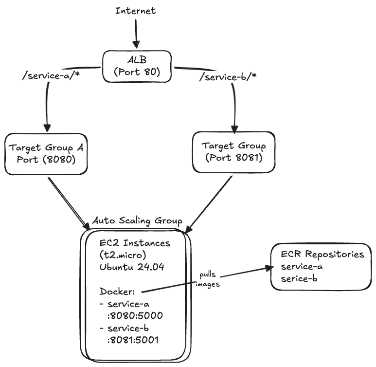
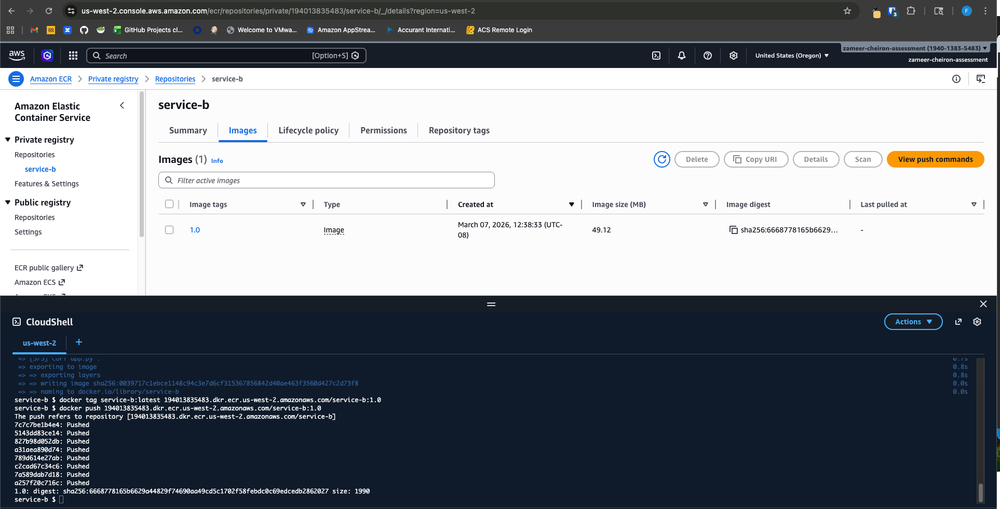
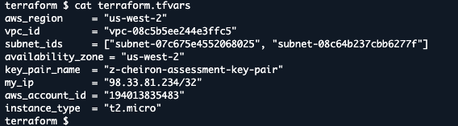
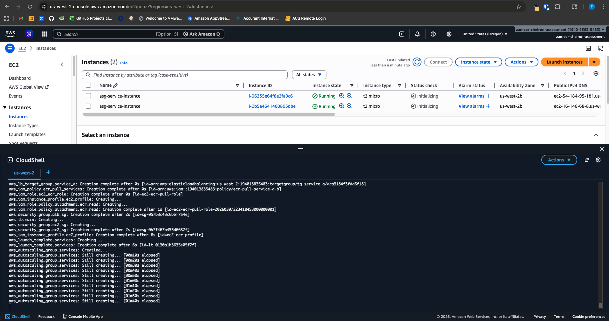
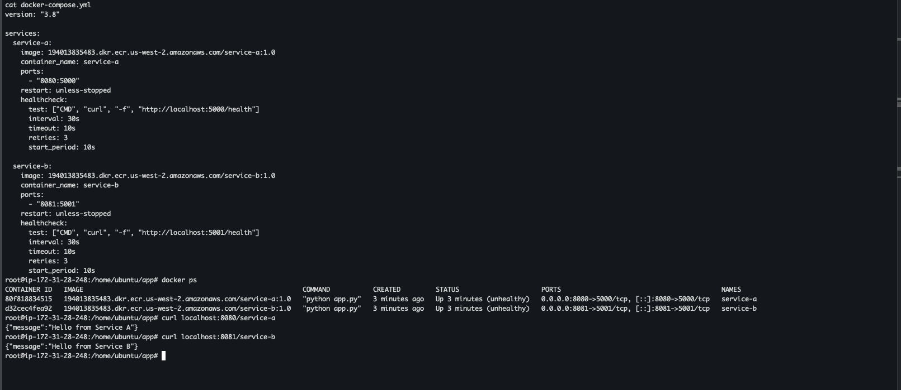
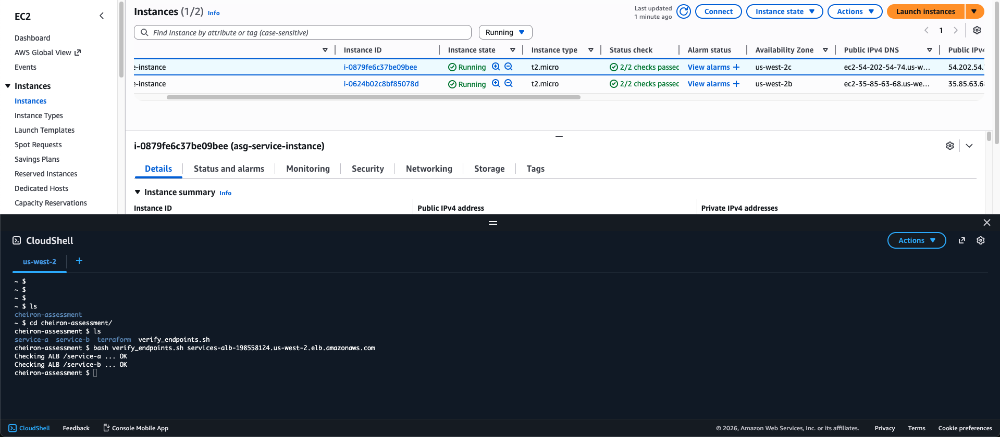
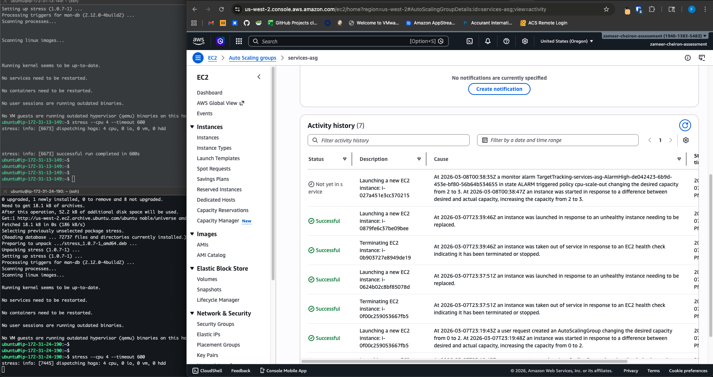
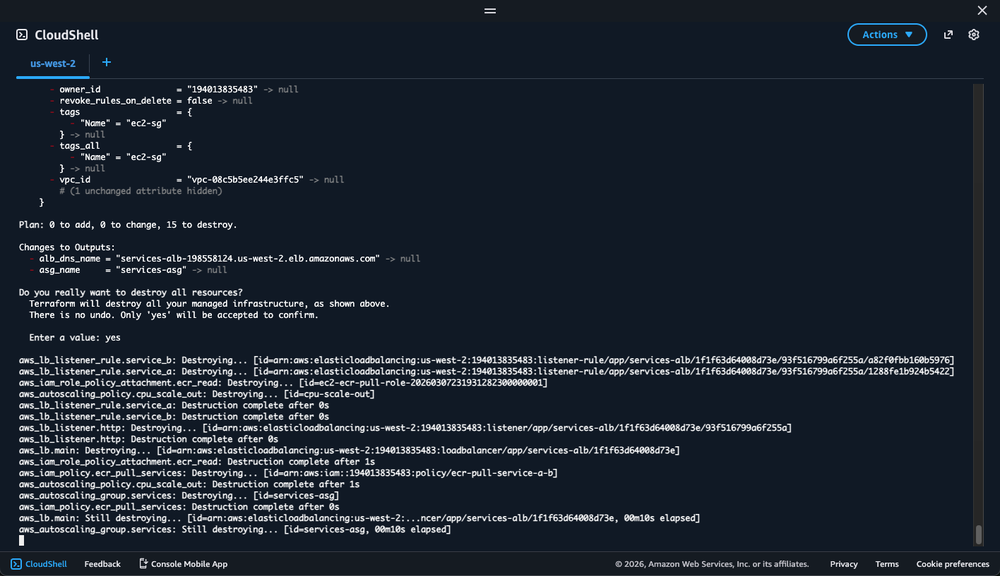

# DevOps Assessment - Microservices Deployment to AWS

## Architecture



## AWS Region

`us-west-2` (Oregon)

## Deployment Steps

### Prerequisites

- AWS CLI configured
- Docker installed locally
- Terraform >= 1.0 installed
- An EC2 key pair in `us-west-2`

### 1. Build and Push Images to ECR

```bash
export AWS_REGION=us-west-2
export AWS_ACCOUNT_ID=$(aws sts get-caller-identity --query Account --output text)

# Authenticate to ECR
aws ecr get-login-password --region $AWS_REGION | \
  docker login --username AWS --password-stdin $AWS_ACCOUNT_ID.dkr.ecr.$AWS_REGION.amazonaws.com

# Build, tag, and push
docker build -t service-a ./service-a
docker build -t service-b ./service-b
docker tag service-a:latest $AWS_ACCOUNT_ID.dkr.ecr.$AWS_REGION.amazonaws.com/service-a:1.1
docker tag service-b:latest $AWS_ACCOUNT_ID.dkr.ecr.$AWS_REGION.amazonaws.com/service-b:1.1
docker push $AWS_ACCOUNT_ID.dkr.ecr.$AWS_REGION.amazonaws.com/service-a:1.1
docker push $AWS_ACCOUNT_ID.dkr.ecr.$AWS_REGION.amazonaws.com/service-b:1.1
```


### 2. Deploy Infrastructure with Terraform

```bash
cd terraform/
cp terraform.tfvars.example terraform.tfvars
```
Edit the tfvars with the current AWS account, VPC, subnet and other configurations.


```
terraform init
terraform plan
terraform apply
```


This provisions: security groups, IAM role, ALB with path-based routing, launch template, ASG (min=2, max=4), and CPU scale-out policy.

EC2 instances are Bootstraped via user-data (installs Docker, authenticates to ECR, creates docker-compose.yml, starts services)


### 3. Verify Services

Once the ASG instances are running and targets are healthy:

```bash
ALB_DNS=$(terraform output -raw alb_dns_name)

curl http://$ALB_DNS/service-a/health
curl http://$ALB_DNS/service-b/health
```

## Running the Verification Script

```bash
chmod +x verify_endpoints.sh
./verify_endpoints.sh <ALB_DNS>
```


The script tests `/service-a/health` and `/service-b/health` through the ALB and exits with code 0 if all checks pass, or 1 if any fail.

## Service Endpoints

| Route | Target | Description |
|-------|--------|-------------|
| `/` | Default | Returns `OK` (ALB fixed response) |
| `/service-a/*` | tg-service-a (port 8080) | Forwarded to service-a containers |
| `/service-b/*` | tg-service-b (port 8081) | Forwarded to service-b containers |

## Security

- **IAM**: Least-privilege custom policy allowing only `ecr:BatchGetImage`, `ecr:GetDownloadUrlForLayer`, and `ecr:BatchCheckLayerAvailability` on the two specific ECR repositories
- **EC2 SG**: SSH restricted to my machine IP; service ports (8080, 8081) only accessible from ALB security group
- **ALB SG**: HTTP/HTTPS open to the internet

## Auto Scaling

- **Launch Template**: Bootstraps EC2 instances via user-data (installs Docker, authenticates to ECR, creates docker-compose.yml, starts services)
- **ASG**: min=2, desired=2, max=4
- **Scale-out policy**: Target tracking on `ASGAverageCPUUtilization` at 40%

To simulate scale-out:
```bash
# SSH into an instance and generate CPU load
stress --cpu 4 --timeout 600
```



## Cleanup

```bash
cd terraform/
terraform destroy
```


All AWS resources are provisioned via Terraform and will be fully removed on `terraform destroy`.
